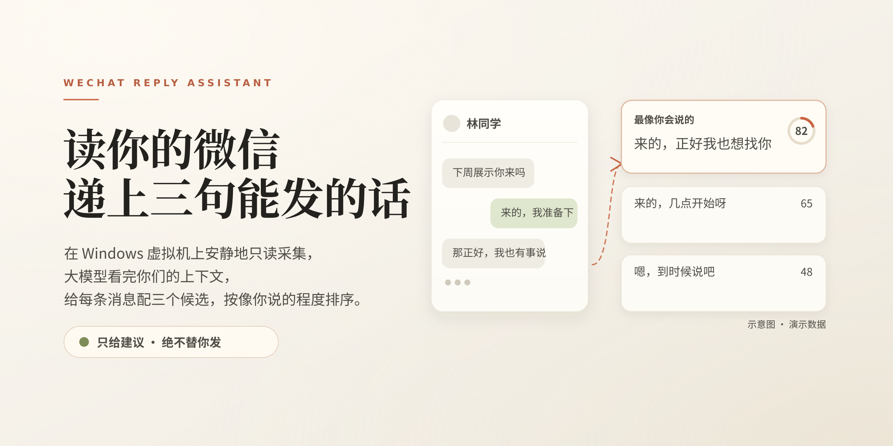
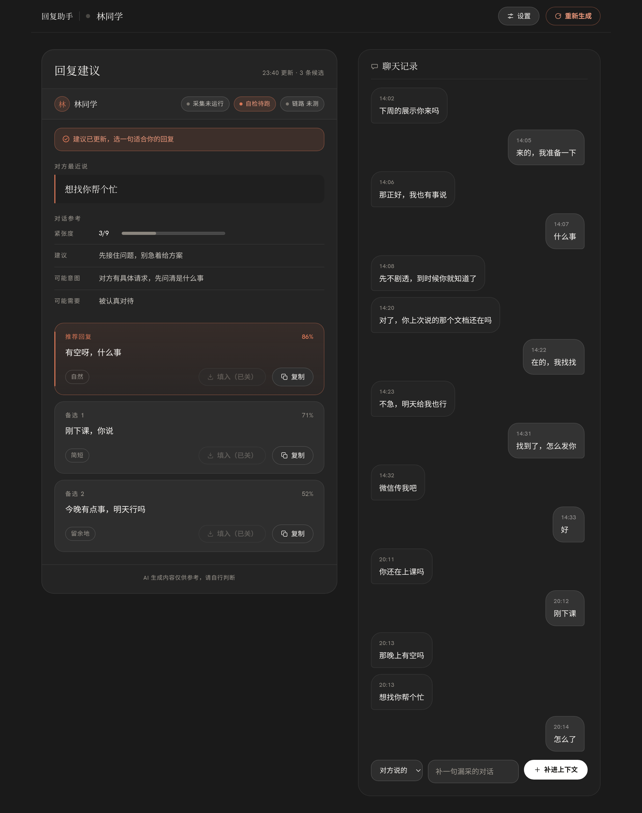
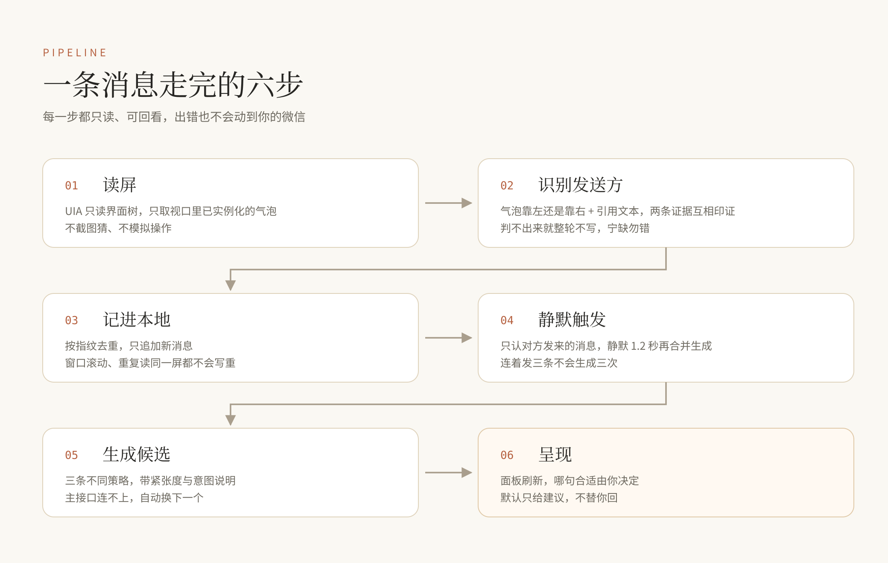
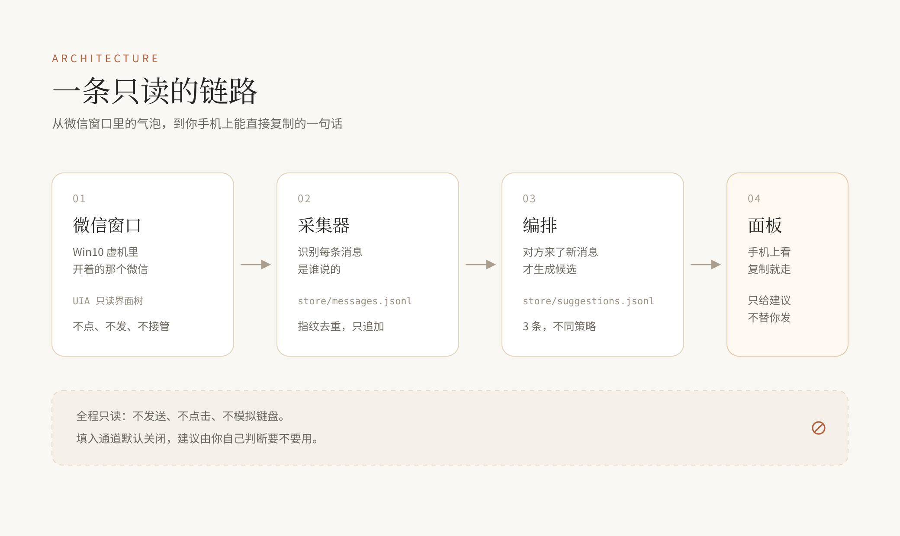

<div align="center">
  
</div>

<br>

# 微信回复助手

**读你的微信，递上三句能发的话。**
只给建议，绝不替你发。

消息弹出来，脑子却一片空白 —— 知道该回，就是想不出怎么开口。
这个工具做的事很小：把对方最近说的话读进来，替你起三个头，
你挑一句顺眼的复制走，或者一句都不用。

它不接管你的微信，不模拟你的键盘，不会在你没看的时候把消息发出去。

<br>

## 它长什么样

<div align="center">
  
</div>

面板只做一件事：把「对方最近说了什么」「这句话大概是什么意思」「三条不同口吻的候选」
摆在同一个屏上。候选卡片上的百分比是模型对自己那句话的把握，不是对你的评分 ——
参考用，别当真。

每条候选都能一键复制。左下角那个「填入」按钮默认是灰的：它能把话填进微信输入框，
但**不会按回车**，而且要你手动打开才生效。这是故意的。

> 上图用的是合成演示数据（`tools/make_demo_store.py` 生成），不是谁的聊天记录。

<br>

## 它怎么工作

<div align="center">
  
</div>

读屏走的是 Windows 的无障碍接口（UIA），不是截图猜字。聊天窗口只暴露正文，
不告诉你哪句是谁说的，所以发送方靠两条证据判断：气泡在左边还是右边（像素），
以及引用气泡里的作者（文字，更稳）。两条对不上就整轮不写，宁可少存一轮。

去重靠指纹，触发靠「对方的消息 + 静默 1.2 秒」，所以对方连发三条只会生成一次。
生成失败会重试，重试是按会话记账的 —— 一个会话失败不会把另一个会话的消息吞掉。

<br>

## 结构

<div align="center">
  
</div>

```
collector/     读屏与入库（PowerShell 跑在虚机里 + Python 解析）
orchestrator/  触发、拼上下文、调模型、校验
prompts/       系统提示词与返回结构
web/           面板（标准库 http.server，带密码）
tools/         虚机连接、演示数据、填入通道
docs/          工程笔记
store/         运行期数据（聊天记录、建议、截图）—— 不进仓库
```

采集器和编排层都可以单独跑：采集器在虚机里是纯 PowerShell，编排层是纯标准库 Python，
只有生成那一步需要网络。

<br>

## 快速开始

前提：微信跑在一台能通过 QEMU guest agent 操作的 Windows 机器上（虚拟机或实体机都行），
并且装了一个能读 UIA 的命令行工具（这个项目用的是 winapp-cli 风格的一套 `ui inspect` /
`ui scroll` / `ui screenshot` 命令）。

> 从零开始 —— Windows 侧那两个工具怎么装、guest agent 怎么验通、模型怎么接、
> 每一步怎么确认成功 —— 都在 **[INSTALL.md](INSTALL.md)**。

```bash
# 0. 环境：建 .venv、装依赖、生成 config.local.yaml、语法自检
#    --demo 顺便造一份合成演示数据，不用连虚机就能看到界面
bash scripts/install.sh --demo

# 1. 虚机连接参数（不进仓库）
$EDITOR config.local.yaml                  # 填 ssh / qga_uuid

# 2. 模型接口：第一次打开面板会自己弹配置框 —— 挑厂商（预置了国内主流那几家，
#    地址已填好）、粘一个 API Key、点「拉取模型列表」选个模型，保存。
#    保存前它会真连一次，连不上不让存。也可以自己写 config.local.yaml（见 INSTALL 第 6 节）

# 3. 起面板看效果（--no-collector = 不连虚机）
.venv/bin/python3 assistant.py up --port 8801 --no-collector
#    首次启动会生成随机密码，写在 store/.panel_password

# 4. 真采集（虚机侧要能读到微信窗口）
.venv/bin/python3 assistant.py up          # 采集 + 自动生成 + 面板 一把起
.venv/bin/python3 assistant.py status
```

Windows 那侧的 winapp CLI、PsExec64、guest agent、电源设置，一条命令体检加补齐：

```powershell
powershell -NoProfile -ExecutionPolicy Bypass -File scripts/setup-windows.ps1 -Auto
```

采集器不用面板也能跑；面板自己带自检线程，发现对方来了新消息就重新生成一轮。

<br>

## 边界

- **只读**。采集不点击、不发送、不模拟键盘；写入只发生在这个项目自己的 `store/` 里
- **填入默认关闭**。要开得显式设置 `store/.allow_fill` 或 `HERMES_PANEL_ALLOW_FILL=1`，
  而且填进去也不会发送 —— 回车永远由你按
- **面板有密码**。密码和会话密钥是启动时随机生成的本地文件，不走任何第三方
- **聊天记录不出本机**。只有「最近若干条对话」会随请求发给模型服务商，
  模型返回三条候选 —— 没有别的数据外流

<br>

## 已知限制

- 只跟当前打开的那一个会话，多会话还没做
- 发送方判定依赖界面布局，微信大改版可能需要重新标定
- 采集需要虚拟机上保持微信窗口开着；锁屏或最小化会读不到
- 生成质量取决于你接的模型。提示词在 `prompts/reply_system.md`，改它比改代码有效

<br>

## 工程笔记

踩过的坑、UIA 到底给了什么、为什么填入必须绕一大圈走 QMP —— 都在
[docs/notes.md](docs/notes.md)。那份笔记比这份 README 长，也更接近这个项目的真相。

<br>

## 许可

个人项目，未附许可协议。要拿去用、改、发，先问一声。
